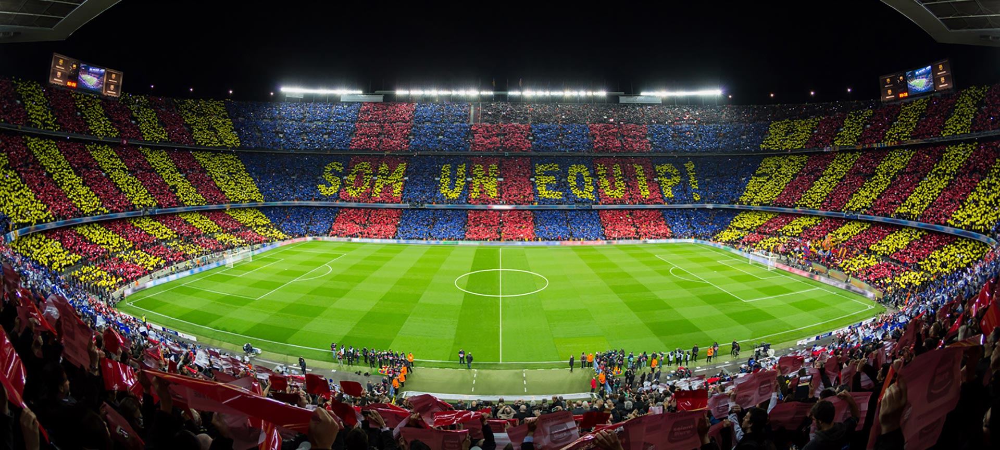

<h1 align="center">Hi 👋, I'm Ahmed Anwar</h1>
<h3 align="center">A Passionat Software Engineer</h3>
 

<!--  -->
<!--  -->

<!-- 
- 🔭 I’m currently working on **ACP**

- 🌱 I’m currently learning **.NET**

- 💬 Ask me about **MERN stack** 

- 🎉 Fun Fact: **捏著鼻子哼哼是不可能的**
-->

<!-- - 📫 How to reach me **ahmed.anwar444442@gmail.com** -->

<!--  -->

<h3>Connect with Me</h3>
Let's connect and share ideas:
 
LinkedIn: <a href="https://www.linkedin.com/in/ahmedanwar1/">Ahmed Anwar</a>
 
Feel free to explore my repositories and reach out if you'd like to collaborate. Thanks for visiting!
